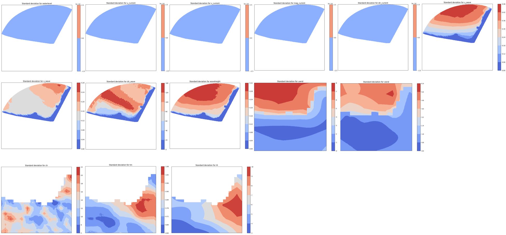
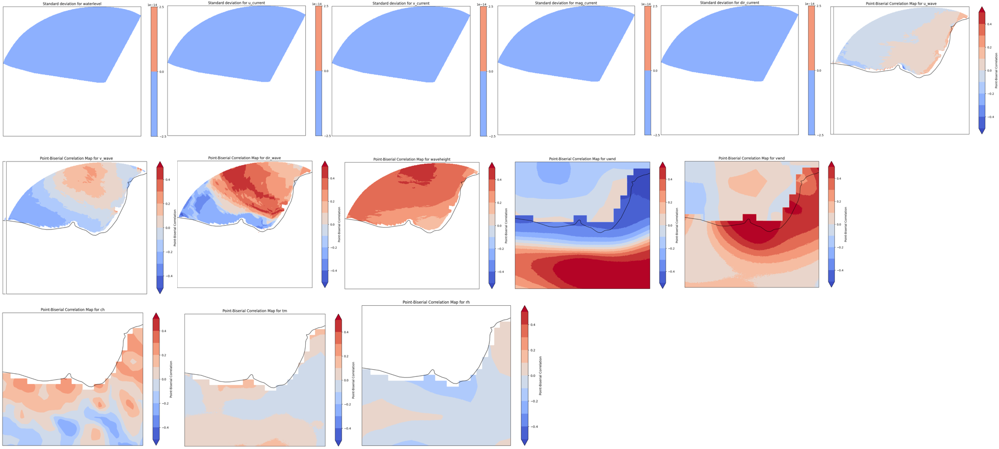
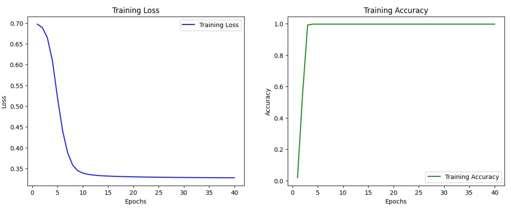
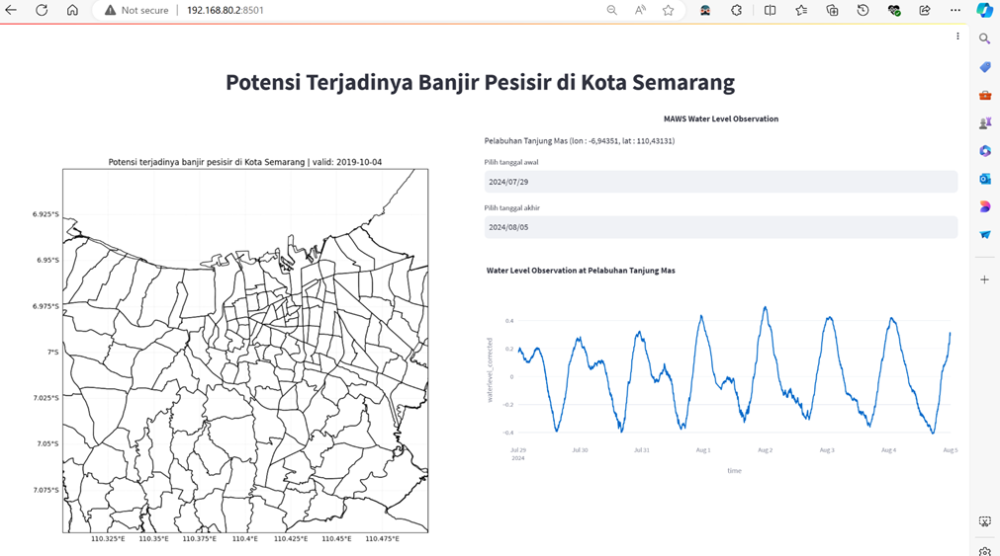

# 1. Background

Banjir rob dapat memberikan dampak yang signifikan terhadap wilayah pesisir. Oleh karena itu, model prediksi diperlukan untuk memperkirakan potensi terjadinya banjir pesisir dalam rangka mitigasi fenomena terebut.

Potensi terjadinya banjir pesisir di wilayah tertentu pada dasarnya dapat ditentukan berdasarkan prediksi pasang apabila melewati nilai ambang batas maksimumnya. Dalam hal ini, nilai ambang batas atau threshold diperoleh secara empiris berdasarkan kejadian banjir pesisir yang pernah terjadi di wilayah tersebut. 

Meskipun metode ambang batas cukup reliable, banjir pesisir dipengaruhi tidak hanya oleh kondisi pasang dan surut, faktor meteorologis seperti curah hujan dan gelombang tinggi juga dapat berpengaruh. Dalam hal ini, data meteorologis biasanya diperoleh dengan melakukan pemodelan numerik, mengingat sangat terbatasnya data observasi khususnya observasi laut seperti gelombang. Kombinasi antara model cuaca numerik dengan data observasi dengan metode tertentu dapat menghasilkan sebaran dalam bentuk peta spasial potensi terjadinya banjir pesisir.

Potensi terjadinya banjir pesisir juga dapat diprediksi menggunakan pendekatan machine learning. Beberapa algoritma machine learning dapat digunakan, misalnya untuk membantu memprediksi banjir pesisir di satu lokasi, dengan menginkorporasi beberapa parameter. Algoritma deep learning dalam hal ini menjadi lazim digunakan karena kompleksitas hubungan antara potensi terjadinya banjir pesisir dengan faktor-faktor yang mempengaruhinya.

Project ini bertujuan untuk melakukan prediksi potensi banjir pesisir meggunakan algoritma ConvLSTM. ConvLSTM dipilih karena menggabungkan struktur konvolusi pada transisi input-ke-state
dan state-to-state, yang memungkinkan model ini untuk menangani data spasial secara bersamaan dengan data temporal. Dalam hal ini, kota Semarang dipilih sebagai lokasi studi eksperimental.

# 2. Data dan Metodologi

# 2.1. Data

1. Data kejadian banjir rob setiap kecamatan di Kota Semarang 2019 -2023 yang diperoleh dari Badan Penanggulangan Bencana Daerah (BPBD) Kota Semarang dan media online.
2. Data curah hujan, kelembapan dan suhu tahun 2019-2023 dari observasi dengan resolusi 5 km x 5 km (data confidental diproduksi oleh BMKG).
3. Water level, currents, wave height dan wind speed dari model numerik dengan resolusi 0,5 km x 0,5 km (data confidental diproduksi oleh BMKG).

# 2.2. Metodologi

Secara umum, alur pekerjaan project ini dibagi menjadi 6 tahap: Pengumpulan data, Preprosesing data, Analisis eksplorasi data, Persiapan data, Pembangunan model, dan Pembuatan dashboard sederhana untuk diseminasi.

*Fig 1. Diagram alir.*

# 2.3. Exploratory Data Analysis

Sebelum melakukan pengembangan model, dilakukan Explotary Data Analysis (EDA) untuk mengetahui parameter yang memiliki pengaruh signifikan pada kejadian banjir rob di Kota Semarang proses ini juga digunakan untuk melihat kualitas data dari data input yang digunakan. Metode yang digunakan dalam proses ini ialah menghitung standar deviasi untuk melihat kualitas data dan menghitung korelasi untuk melihat pengaruh parameter terhadap kejadian banjir rob di Kota Semarang.

## 2.3.1. STD

*Fig 2. Standar deviasi.*

Standar deviasi parameter water level, u-current, v-current, mag current dan direction current menunjukkan nilai standar deviasi nol, artinya parameter tersebut memiliki nilai yang sama yang mengindikasikan kualitas data ini kurang baik. Sedangkan parameter u wave, v wave, direction wave, waveheight, u-wind, v-wind, kelembapan udara, suhu udara dan curah hujan memiliki standar deviasi yang bevariasi, artinya parameter tersebut memiliki nilai yang bervariasi. 

## 2.3.2. Corr

*Fig 3. Korelasi.*

Parameter u-wave, v-wave, waveheight, u-wind, v-wind dan  curah hujan memiliki nilai korelasi yang tinggi, yang artinya memiliki hubungan yang signifikan dengan kejadian banjir rob di Kota Semarang. Sedangkan parameter kelambapan udara dan suhu udara tidak memiliki nilai korelasi yang tinggi, yang artinya tidak memiliki hubungan yang signifikan dengan kejadian banjir rob di Kota Semarang. Sehingga, diputuskan parameter yang diambil sebagai input model adalah u wave, v wave, waveheight, u-wind, v-wind, dan curah hujan (6 parameter).

# 2.4. Algoritma model

Sebagaimana yang disampaikan di awal, project ini memanfaatkan algoritma ConvLSTM untuk memprediksi potensi terjadinya banjir pesisir. ConvLSTM dipilih karena mengkonsiderasi tidak hanya secara spasial, tetapi juga temporal.

# 3. Hasil Pengembangan Model

Pengembangan model ini menggunakan metode ConvLSTM dengan menggunakan modul PyTorch, dimana proses metode Convolutional secara spasial dan LSTM secara time series secara bersamaan dengan menggunakan module Conv_LSTM. Pengembangan model ini menggunakan training dan testing data input sebanyak 201 hari dan data output (target) sebanyak 67 hari (70% untuk training dan 30% untuk testing dari total keseluruhan data yang digunakan). Hal ini dibuat dengan mempertimbangkan sequence length yaitu 3 hari. Sehingga model menggunakan inputan data 3 hari belakang (contoh: 3 mei, 4 mei, 5 mei) untuk memprediksi 1 hari kedepan (contoh: 6 mei).

Sebagai awalan digunakan epoch=10, batch_size=10, seq_len=3, kernel_size=(3,3), dan input hidden_dim= [16,8,1]. Berdasarkan performa model, konfigurasi nilai epoch di ubah menjadi 20 (dikarenakan pada epoch 10 ke 20 masih terdapat pengurangan nilai loss walau tidak signifikan) dan kernel_size diubah menjadi (5,5) agar bisa mempertimbangkan lebih banyak grid disekitarnya.

*Fig 4. Konfigurasi model.*

Terdapat masalah ketika dilakukan running model, yakni beberapa parameter yang menjadi data inputan memiliki data NaN. Hal ini membuat model Conv_LSTM menjadi error  (nilai loss = nan). Untuk mengatasi masalah tersebut, dilakukan modifikasi module original Conv_LSTM untuk mengabaikan array yang memiliki value NaN dengan metode masking. Detailnya, pertama dibuat masking_tensor untuk parameter input, lalu masking_tensor tersebut dimasukkan sebagai inputan saat pembangunan model. Hasil akhirnya adalah model dapat berjalan dengan mengabaikan grid NaN.

Untuk performa model ini sendiri masih butuh pengembangan, dimana masih belum berhasil mendeteksi kejadian banjir rob dengan akurat.

*Fig 5. Grafik epoch terhadap nilai loss (kanan) dan terhadap nilai accuracy (kiri).*

Training loss pada epoch ke 10-20 stagnan di nilai 0.35. 
Sedangkan accuracy secara umum cukup baik jika hanya melihat nilainya saja, yakni pada epoch 0-5 sudah mencapai 90% (0.9). Namun, hal ini disebabkan oleh model yang memprediksi kejadian no rob (tidak ada banjir) untuk semua data test.

Output dari model ini merupakan prediksi probabilitas kejadian banjir rob satu hari kedepan secara spasial dengan resolusi 0,5 km x 0,5 km di Kota Semarang. Output ini ditampikan dalam area per kelurahan.

*Fig 6. Dashboard model*

# References and Code 

https://colab.research.google.com/drive/1zYdi_rCuJ0_4_pUn_9g8eGSi8XOD3i4N?usp=sharing (ulil)
