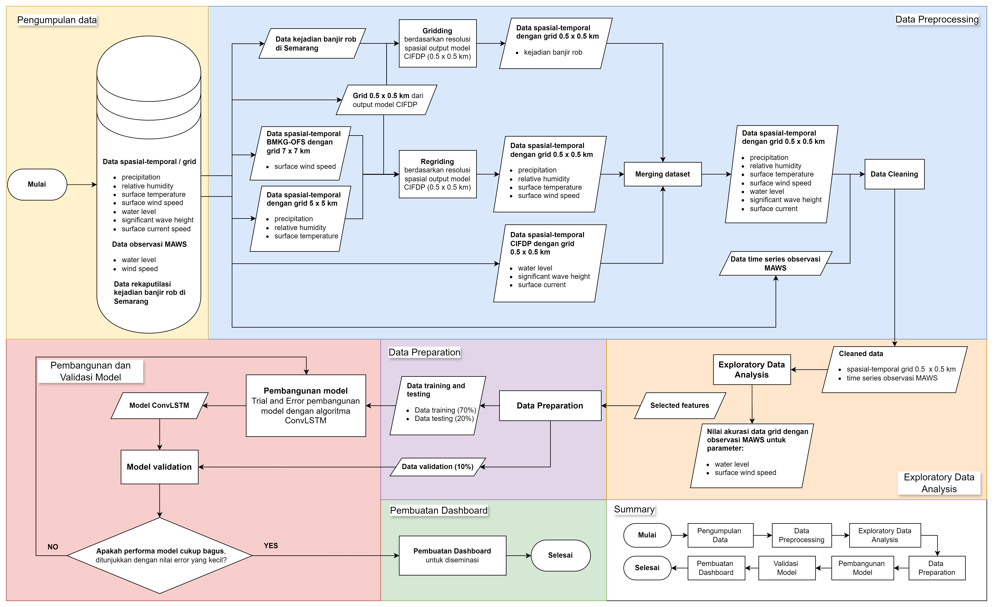
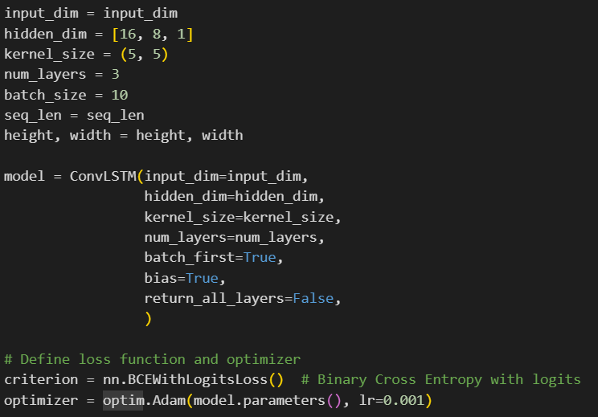

# 1. Background

Banjir rob dapat memberikan dampak yang signifikan terhadap wilayah pesisir. Oleh karena itu, model prediksi diperlukan untuk memperkirakan potensi terjadinya banjir pesisir dalam rangka mitigasi fenomena terebut.

Potensi terjadinya banjir pesisir di wilayah tertentu pada dasarnya dapat ditentukan berdasarkan prediksi pasang apabila melewati nilai ambang batas maksimumnya. Dalam hal ini, nilai ambang batas atau threshold diperoleh secara empiris berdasarkan kejadian banjir pesisir yang pernah terjadi di wilayah tersebut. 

Meskipun metode ambang batas cukup reliable, banjir pesisir dipengaruhi tidak hanya oleh kondisi pasang dan surut, faktor meteorologis seperti curah hujan dan gelombang tinggi juga dapat berpengaruh. Dalam hal ini, data meteorologis biasanya diperoleh dengan melakukan pemodelan numerik, mengingat sangat terbatasnya data observasi khususnya observasi laut seperti gelombang. Kombinasi antara model cuaca numerik dengan data observasi dengan metode tertentu dapat menghasilkan sebaran dalam bentuk peta spasial potensi terjadinya banjir pesisir.

Potensi terjadinya banjir pesisir juga dapat diprediksi menggunakan pendekatan machine learning. Beberapa algoritma machine learning dapat digunakan, misalnya untuk membantu memprediksi banjir pesisir di satu lokasi, dengan menginkorporasi beberapa parameter. Algoritma deep learning dalam hal ini menjadi lazim digunakan karena kompleksitas hubungan antara potensi terjadinya banjir pesisir dengan faktor-faktor yang mempengaruhinya.

Project ini bertujuan untuk melakukan prediksi potensi banjir pesisir meggunakan algoritma ConvLSTM. ConvLSTM dipilih karena menggabungkan struktur konvolusi pada transisi input-ke-state
dan state-to-state, yang memungkinkan model ini untuk menangani data spasial secara bersamaan dengan data temporal. Dalam hal ini, kota Semarang dipilih sebagai lokasi studi eksperimental.

# 2. Data dan Metodologi

# 2.1. Data

1. Data kejadian banjir rob setiap kecamatan di Kota Semarang 2019 -2023 yang diperoleh dari Badan Penanggulangan Bencana Daerah (BPBD) Kota Semarang dan media online.
2. Data curah hujan, kelembapan dan suhu tahun 2019-2023 dari observasi dengan resolusi 5 km x 5 km (data confidental diproduksi oleh BMKG).
3. Water level, currents, wave height dan wind speed dari model numerik dengan resolusi 0,5 km x 0,5 km (data confidental diproduksi oleh BMKG).

# 2.2. Metodologi

Secara umum, alur pekerjaan project ini dibagi menjadi 6 tahap: Pengumpulan data, Preprosesing data, Analisis eksplorasi data, Persiapan data, Pembangunan model, dan Pembuatan dashboard sederhana untuk diseminasi.

*Fig 1. Diagram alir.*

## 2.2.2 Algoritma model

Sebagaimana yang disampaikan di awal, project ini memanfaatkan algoritma ConvLSTM untuk memprediksi potensi terjadinya banjir pesisir. ConvLSTM dipilih karena mengkonsiderasi tidak hanya secara spasial, tetapi juga temporal.

# 3. Hasil Pengembangan Model

# References and Code 

https://colab.research.google.com/drive/1zYdi_rCuJ0_4_pUn_9g8eGSi8XOD3i4N?usp=sharing (ulil)
