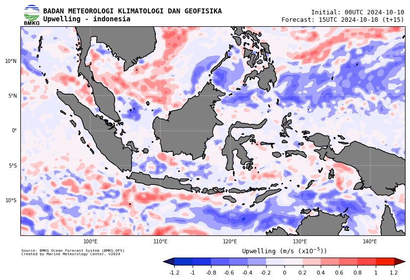

Upwelling region can be estimated from surface wind. This is done through Ekman Pumping Velocity, derivied from wind stress and wind stress curl. Following Simanjuntak and Lin (2022)[^1], this article will explain step by step calculation on how to derivied Ekman Pumping Velocity to determine upwelling region based on multidimensional gridded data.

# Data

We will use data from BMKG-OFS, produced by Center for Marine Meteorology. This data contains $u$ and $v$ component of wind vector. It has $0.0625\degree \times 0.0625\degree$ spatial resolution and 3-hourly temporal resolution. 

You can request the sample of the data by contacting me, or feel free to use your own data, you only need $u$ and $v$ component of wind vector in gridded field. 

# Surface Wind Stress ($\tau$)

The sea surface wind data can be converted into wind stress ($\tau$) based on the following equation.

$$ \tau = \rho_a C_d U^{2}_{10}  $$

where $\rho_a$ is the air density, $C_d$ is drag coeficient, and $U^{2}_{10}$ is wind speed at a 10m height.

# Wind Stress Curl

Wind stress curl is calculated from wind stress vector component.

$$ curl = \frac{\partial\tau_y}{\partial x} - \frac{\partial \tau_x}{\partial y} $$

# Ekman Pumping Velocity

$$ EPV = - \frac{curl}{\rho_w f} $$

where $\rho_w$ is the water density and $f$ is the coriolis parameter.

# Scripting with Python

```python
import numpy as np 
import xarray as xr 
from scipy.ndimage import gaussian_filter
from datetime import datetime, timedelta

class Upwelling:
    def __init__(self):
        self.__RHOA__  = 1.225
        self.__RHOW__  = 1028
        self.__DC__    = 1.25e-3
        self.__OMEGA__ = 7.29e-5

    def calc_wind_stress(self, dset:xr.Dataset, uwnd:str, vwnd:str) -> xr.Dataset:
        dset['uwnd_stress'] = (self.__RHOA__*self.__DC__*dset[uwnd])*(np.sqrt(dset[uwnd]**2 + dset[vwnd]**2))
        dset['vwnd_stress'] = (self.__RHOA__*self.__DC__*dset[vwnd])*(np.sqrt(dset[uwnd]**2 + dset[vwnd]**2))
        return dset 

    def calc_wind_curl(self, dset:xr.Dataset, uwnd_stress:str, vwnd_stress:str, lat:str) -> xr.Dataset:
        dy = 0.0625*111320 # adjust to your latitude resolution
        dx = 0.0625*111320 # adjust to your longitude resolution

        corioli = 2 * self.__OMEGA__ * np.sin(np.deg2rad(dset[lat]))
        dset['corioli'] = corioli.expand_dims({'time': dset.dims['time'], 'lon': dset.dims['lon']}, axis=(0, 2)) # adjust to your data, in this case the order is time-lat-lon
        d_tau_y_dx = np.gradient(dset[vwnd_stress], dx, axis=2)
        d_tau_x_dy = np.gradient(dset[uwnd_stress], dy, axis=1)
        wind_curl = (d_tau_y_dx - d_tau_x_dy)
        dset['wind_curl'] = (('time', 'lat', 'lon'), wind_curl)
        return dset

    def calc_epv(self, dset:xr.Dataset, wind_curl:str, corioli:str) -> xr.Dataset:
        epv = dset[wind_curl] / (self.__RHOW__ * dset[corioli])
        dset['epv'] = epv
        return dset
```

# Execution and Plotting
```python
class uwPlotter(plotter): 
    '''
    You can make your own plotter, this class is inherit from the other class (plotter) which contains hundreds of lines to plot the data
    '''
    def __init__(self):
        super().__init__()
        self.__TIMENOW__ = datetime.now()

    def gaussian_blur(self, dset, sigma=3):
        dset['epv'] = xr.where(np.isfinite(dset['epv']), dset['epv'], 0)
        dset['epv'] = xr.where((dset['epv'] > -0.00001) & (dset['epv'] < 0.00001), dset['epv'], 0)
        dset['epv'] = dset['epv']*100000
        blurred_data = gaussian_filter(dset['epv'].values, sigma=sigma)
        dset['epv'] = xr.DataArray(blurred_data, coords=dset['epv'].coords, dims=dset['epv'].dims)
        return dset
    
    def run_plot_uwp(self, baserun, tsel, ds, area_name, out_dir):
        ds = ds.isel(time=tsel)
        forecast = pd.to_datetime(ds.time.data)
        logging.info(f"======Running Plotter for {area_name} | baserun: {baserun} | forecast: {forecast}======")
        ds = self.gaussian_blur(ds)
        self.run_plot(
            ds=ds,
            var='epv',
            wilpel='wilpel',
            wilpel_name=area_name,
            map_area=area_name,
            out_dir=out_dir,
            baserun=baserun,
            forecast=forecast,
        )
```

The script above is a part of the production script to generate upwelling maps that can be seen through this link (https://maritim.bmkg.go.id/ofs-static), select Model: Ina-flow and Parameter: Upwelling.


*Sample of Upwelling maps*

# References

[^1]: https://doi.org/10.3390/rs14071682